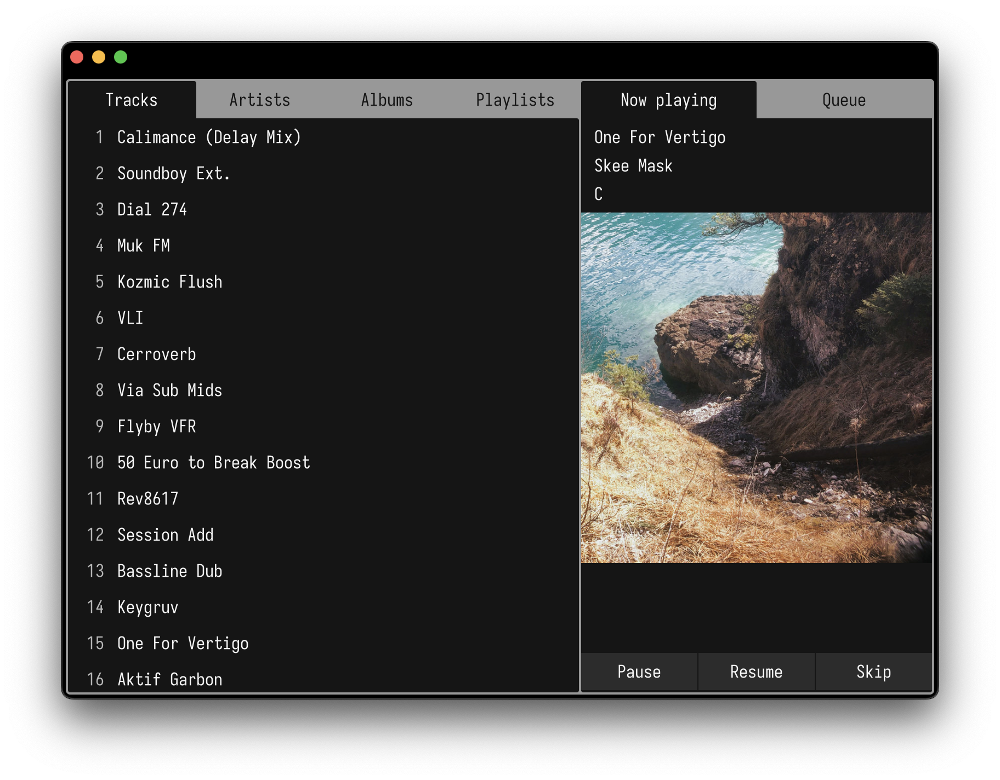

# Kallax

WIP music player built with [gpui](https://www.gpui.rs/).




## Development

Create a `.env` file in the repo root:

```sh
LIBRARY_DIR="$HOME/Music"
LASTFM_API_KEY=xxx
LASTFM_SECRET_KEY=xxx
LASTFM_SESSION_KEY=xxx
```

Only `LIBRARY_DIR` is required.

Tracks loaded from your library are cached - run
`rm -rf "~/Library/Application Support/org.kallax.kallax"` to clear the cache and change your
library directory.
